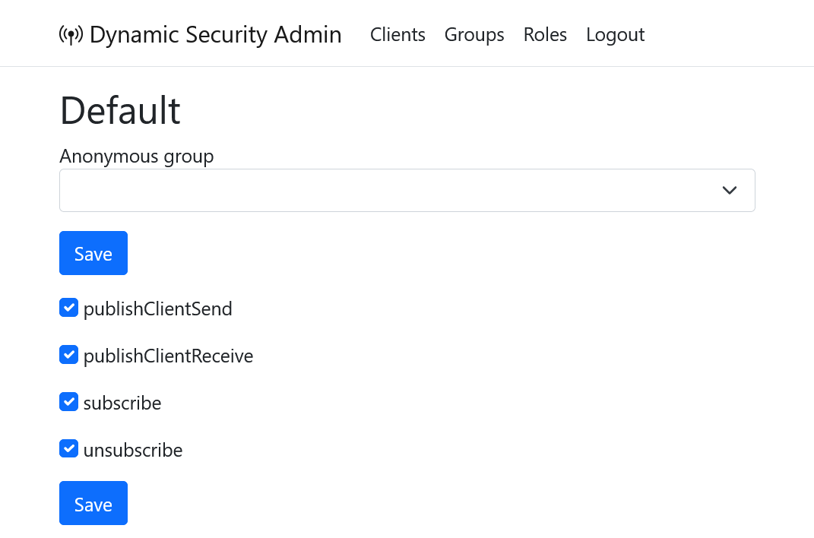
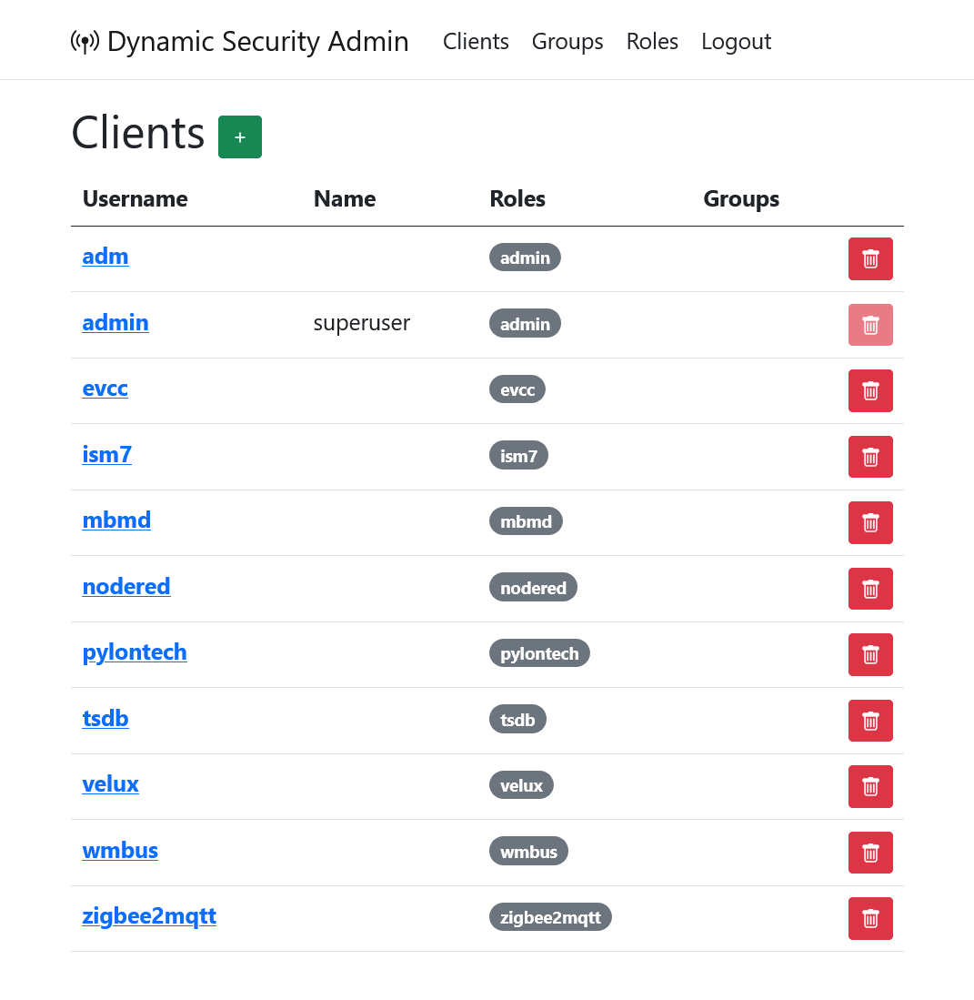
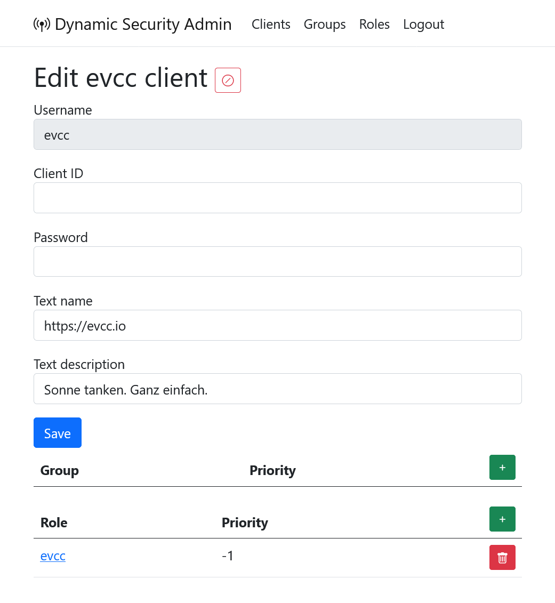
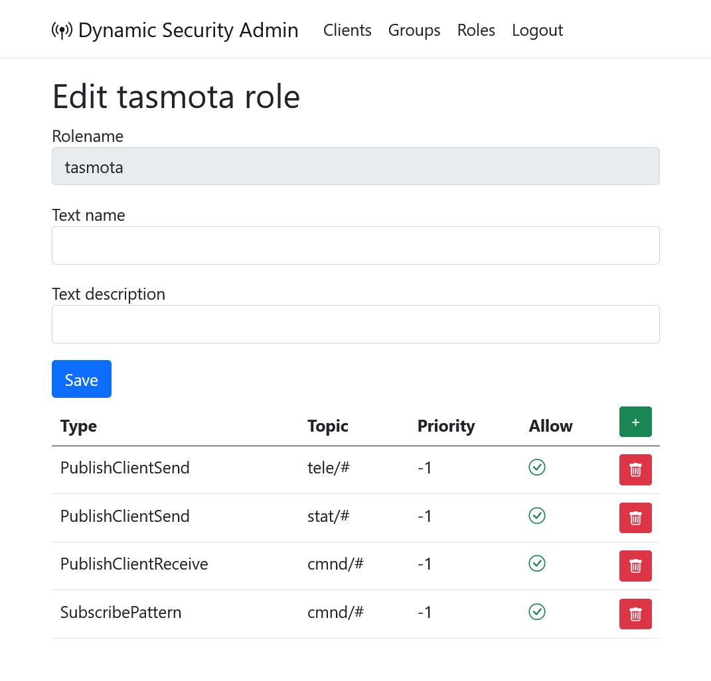
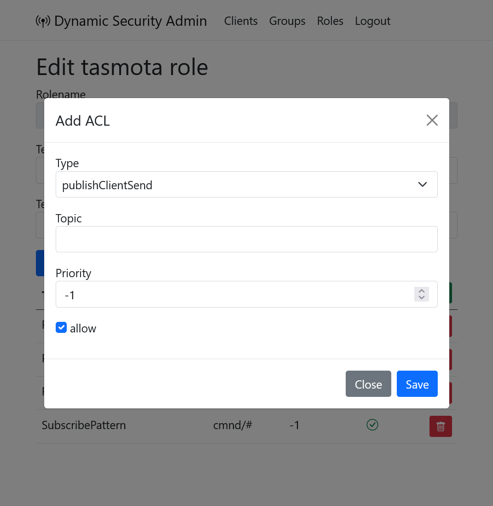

# Dynamic Security Admin

Simple web interface for [mosquitto Dynamic Security](https://mosquitto.org/documentation/dynamic-security/) administration.

## Why?

[mosquitto recommends](https://mosquitto.org/documentation/dynamic-security/#usage) either `mosquitto_ctrl` (which is a commandline app) or the Management Center for Mosquitto which is web based but I had a hard time to get it running and was disappointed that it mirrored all MQTT traffic into my browser with ~40MB/s.

## How?

Either you know what you are doing, or you just use docker:
```bash
docker run -e MQTTSERVER=<your mqtt server> -p 8080:80 zivillian/dynamic-security-admin:latest 
```

## Screenshots?

### Defaults



### List clients



### Edit client



### Edit role



### Add ACL to role


